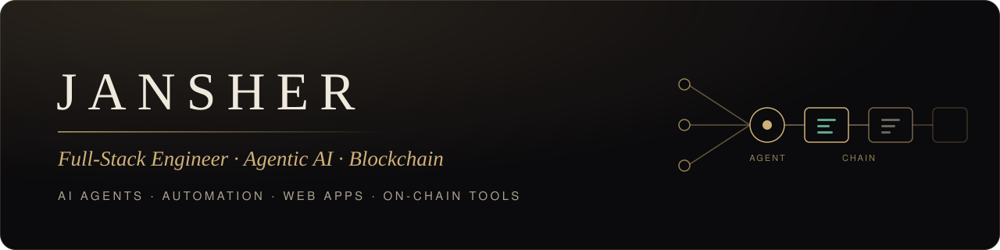

  

  <b>I build AI agents, full-stack products and on-chain tools that run in production.</b> 
  Automation pipelines · Real-time crypto dashboards · Self-hosted infrastructure

 

### What I work on

- **Agentic AI:** LLM agents with tools and memory, multi-step automations, MCP integrations, and AI assistants that help run real systems.
- **Full-stack engineering:** Next.js and React front ends, Node.js and Python back ends, PostgreSQL, scrapers and rendering services.
- **Blockchain & crypto:** market-data pipelines, signal and risk dashboards, smart contracts and wallet integrations on EVM chains.
- **Infrastructure:** Docker, nginx, Linux server hardening, SSL, backups and monitoring.

### Tech stack

**AI & automation** 

**Full stack** 

**Blockchain** 

**Infrastructure** 

### Selected work

| Project | What it does | Stack |
|---|---|---|
| **Crypto Signal Desk** | Real-time BTC and altcoin dashboard: 80% price ranges, move-outcome stats and live indicator votes, backtested on 3 years of data. | Node.js · exchange APIs · data viz |
| **AI Ops Agent** | An autonomous AI agent that helps maintain servers, run security checks and keep a shared knowledge base up to date. | LLM agents · Docker · Markdown |
| **Automation Platform** | 18 self-hosted workflows for lead generation, scraping, email and content, with locked-down code execution and encrypted credentials. | n8n · PostgreSQL · Docker |
| **Maps Lead Scraper** | A service that turns map listings into clean lead lists. | Node.js |
| **Poster Renderer** | Generates marketing visuals on demand from templates. | Node.js |
| **Business Websites** | Fast, SEO-ready sites for construction and solar companies. | Next.js · nginx |

Most of this is client or private work. Walkthroughs are available on request.

### Now

- Building agent-driven trading and research tools
- Connecting LLM agents to on-chain data and smart contracts

### Let's work together

Open to freelance and full-time work in **AI agents**, **full-stack** and **Web3**. Message me here on GitHub.

<!-- Add a public contact link here when ready, e.g. LinkedIn or a portfolio site. Avoid personal email or phone. -->
